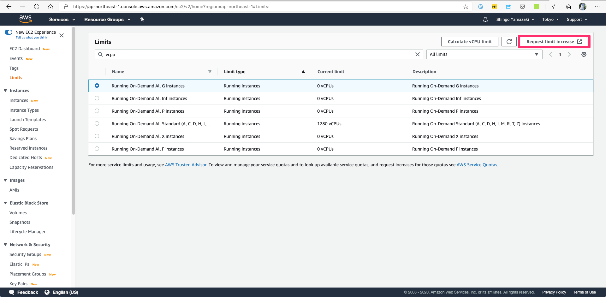
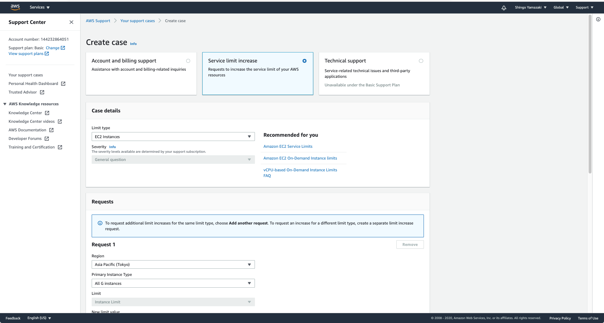

[AWSによるクラウド入門](https://tomomano.gitlab.io/intro-aws/)
====================


#### 3.5.3. ミニ・ハンズオン: AWS CLI を使ってみよう

```sh
# profile を追加する場合
$ aws configure --profile my-new-profile
AWS Access Key ID [None]: ***********
AWS Secret Access Key [None]: ************
Default region name [None]: ap-northeast-1
Default output format [None]: json

$ export AWS_PROFILE=my-new-profile
```

```sh
# s3のバケット生成
$ aws s3 mb "s3://${bucketName}"


# バケットの確認
$ aws s3 ls


# バケットにファイル追加
$ aws s3 cp hello_world.txt "s3://${bucketName}/hello_world.txt"

# バケットの削除 (バケット内にファイルが存在する場合は--forceが必要)
$ aws s3 "s3://${bucketName}" --force
```

### 3.6. CloudFormation と AWS CDK

- リソースを操作するコマンドと、タスクを実行するコマンドに分けられる
  - リソース操作: s3 にバケット作成、EC2 のインスタンス起動など、静的なリソースを操作
  - タスク実行: EC2 のインスタンスにジョブを投入したり，S3 のバケットにデータを読み書きするなどの動的な操作
- CloudFormationはAWSでのリソースを管理するための仕組み
  - JSONで記述する。記述量が膨大

#### 3.6.2 AWS CDK
- CDK: Cloud Development Kit
- Python などのプログラミング言語を使ってCloudFormationを自動的に生成してくれるツール


## 4. Hands-on #1: 初めてのEC2インスタンスを起動する

- VPC, Security Group(SG), EC2 インスタンスの作成例
- 4.3.2 Security Group

> Security group (SG) は，EC2インスタンスに付与することのできる仮想ファイアーウォールである．例えば，特定のIPアドレスから来た接続を許したり　(インバウンド・トラフィックの制限) ，逆に特定のIPアドレスへのアクセスを禁止したり (アウトバウンド・トラフィックの制限) することができる．

### :warning: ハマったところ

4.4.4. デプロイを実行

```
$ cdk deploy -c key_name="XXX"
```

`-c` は context。  
https://docs.aws.amazon.com/cdk/latest/guide/context.html

context はコード中では

```ts
const keyName = this.node.tryGetContext('key_name');
```

のような形で取り出す。

## 6. Hands-on #2: AWSでディープラーニングの計算を走らせる

- AMI の一覧を表示

```
$ aws ec2 describe-images --owners amazon
```


### :warning: ハマったところ

デプロイしようとするとエラー

1)

```
$ cdk deploy -c key_name="XXX"
Unable to determine AMI from AMI map since stack is region-agnostic
Subprocess exited with error 1
```

解決策: `region` を渡してあげる必要があったが、それは `lib/xxx-stack.ts` ではなく `bin/xxx.ts` に書く必要があった

```ts
const app = new cdk.App();
new XXXStack(app, 'XXXStack', {
  env: {
    region: process.env.CDK_DEFAULT_REGION,
    account: process.env.CDK_DEFAULT_ACCOUNT,
  }
});
```

2)

```
You have requested more vCPU capacity than your current vCPU limit of 0 allows for the instance bucket that the specified instance type belongs to. Please visit http://aws.ama zon.com/contact-us/ec2-request to request an adjustment to this limit. (Service: AmazonEC2; Status Code: 400; Error Code: VcpuLimitExceeded; Request ID: *****; Proxy: null)
```

vCPU の上限を引き上げる必要があった






## 7. Docker を用いた大規模機械学習システムの構築

### 7.4 Elastic Container Service (ECS)

- Docker を使った計算機クラスターをAWS上に作成するためのツール
- タスク(Task)と呼ばれる単位で管理された計算ジョブを受け付ける

### 7.5 Fargate

- EC2 に似たものだが、ECS での利用に特化している
  - EC2 に比べ、制約はあるかわりに設定しないといけない値が少ない


## 8. Hands-on #3: AWSで自動質問回答ボットを走らせる

- ディープラーニングを使ったQ&Aボット
- Transformer: ディープラーニングのモデル

#### 8.3.1 ECS と Fargate


### :warning: トラブルシューティング

```ts
const table = new dynamodb.Table(this, 'EcsClusterQaBot-Table', ...
                                 ^^^^
```

`this` でエラー

```
Argument of type 'this' is not assignable to parameter of type 'Construct'.
  Type 'Ch08Stack' is not assignable to type 'Construct'.
    Types of property 'node' are incompatible.
      Type 'import("/Users/yamazaki/repos/github.com/zaki-yama-labs/intro-aws/ch08/node_modules/@aws-cdk/core/lib/construct-compat").ConstructNode' is not assignable to type 'import("/Users/yamazaki/repos/github.com/zaki-yama-labs/intro-aws/ch08/node_modules/@aws-cdk/aws-iam/node_modules/@aws-cdk/core/lib/construct-compat").ConstructNode'.
        Types have separate declarations of a private property 'host'.
```

-> `@aws-cdk/core` とそれ以外のパッケージのマイナーバージョンがずれてた (coreが `1.63.0`、それ以外が `^1.64.1`)


2) `run_task.py` を実行エラー

```
$ python run_task.py ask "A giant peach was flowing in the river. She picked it up and brought it home. Later, a healthy baby was born from the peach. She named the baby Momotaro." "What is the name of the baby?" 
Traceback (most recent call last):
  File "run_task.py", line 173, in <module>
    ask(args.context, args.question)
  File "run_task.py", line 22, in ask
    P = Params()
  File "run_task.py", line 12, in __init__
    self.ECS_CLUSTER_NAME = ssm_client.get_parameter(Name="ECS_CLUSTER_NAME")["Parameter"]["Value"]
  File "/Users/yamazaki/repos/github.com/zaki-yama-labs/intro-aws/ch08/.venv/lib/python3.8/site-packages/botocore/client.py", line 337, in _api_call
    return self._make_api_call(operation_name, kwargs)
  File "/Users/yamazaki/repos/github.com/zaki-yama-labs/intro-aws/ch08/.venv/lib/python3.8/site-packages/botocore/client.py", line 656, in _make_api_call
    raise error_class(parsed_response, operation_name)
botocore.errorfactory.ParameterNotFound: An error occurred (ParameterNotFound) when calling the GetParameter operation:
```

-> `ECS_CLUSTER_NAME` などは SSM に保存していた  
https://gitlab.com/tomomano/intro-aws/-/blob/master/handson/03-qa-bot/app.py#L76-101


## 10. Serverless architecture

- サーバーレスとはなにか
  - 従来のServerfulクラウド:
    - クラウド上のサーバーをユーザーが独占してしまうので、使っても使わなくても起動時間に比例したコストがかかる
  - Serverlessクラウド:
    - 計算リソースの管理はすべてクラウドプロバイダー側が行う
    - ユーザーは実行したいプログラムをクラウドに提出する
    - -> コストはプログラムの実行に使用した計算の総量で決定される

### 10.3 Lambda

### 10.4 S3
- サーバーレスなストレージシステム
- ディスクサイズとか気にせずデータを保存でき、保存したデータのサイズに応じた料金がかかる

### 10.5 DynamoDB

### 10.6 その他

- API Gateway
- Fargate
- Simple Notification Service (SNS)
  - サーバーレスのサービス間(Lambda と DynamoDB など)でイベントをやり取りするためのサービス
- Step Functions
  - サーバーレスのサービス間のオーケストレーション

---

## リファレンス

CDKのTypeScript用リファレンス

- 8章 DynamoDB.Table https://docs.aws.amazon.com/cdk/api/latest/docs/@aws-cdk_aws-dynamodb.Table.html

